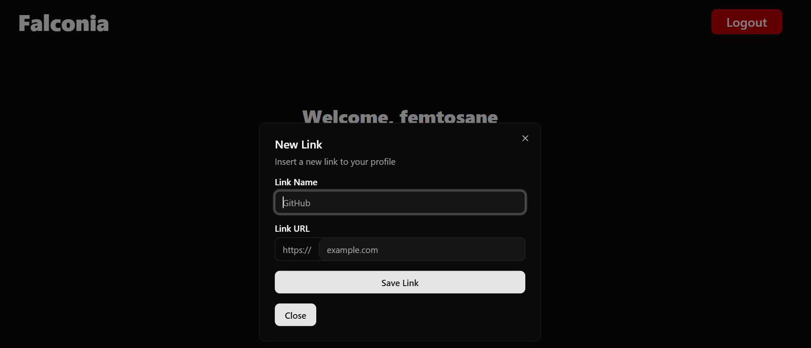
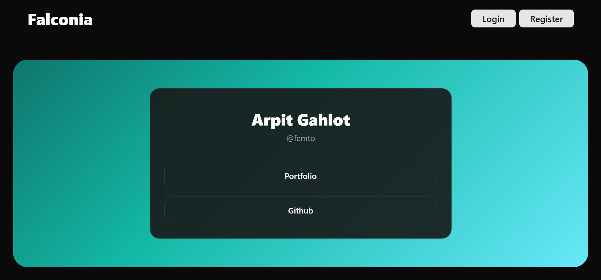

# Falconia

A linktree style app that the users can use to store and share all their important links at one place. 

## Steps to run the application locally

1) Setup the application.properties file with the connection string.

2) Install the dependencies for springboot.

3) Compile and run `src/main/java/com/femto/falconia/FemtoFalconiaProjectApplication.java`.

4) Go to the frontend folder and install the dependencies using npm 

5) run `npm run dev` to start the frontend